# Лабораторная работа № 1

## Создание виртуального окружения. Контроллеры и маршруты

**Студент:** Зорькин Арсений Станиславович<br>
**Группа:** ПИЖ-б-о-25-2(1)<br>
**Технология:** Python + Django<br>
**Дата выполнения:** 28.09.2026

## Содержание

- [1 Цель работы](#1-цель-работы)
- [2 Теоретическое обоснование](#2-теоретическое-обоснование)
- [3 Выполнение работы](#3-выполнение-работы)
- [4 Вывод](#4-вывод)

## 1 Цель работы

Настроить виртуальное окружение Python, создать проект Django, научиться принимать HTTP-запросы в представлениях и связывать адреса с представлениями через маршрутизацию.

## 2 Теоретическое обоснование

Виртуальное окружение хранит зависимости проекта отдельно от глобального Python. Проект Django содержит общие настройки и корневые маршруты, а приложение объединяет код одной функциональной области. Представление получает объект запроса и возвращает HTTP-ответ. Маршрутизатор сопоставляет URL с представлением; `include()` позволяет хранить маршруты приложения отдельно от корневых.

## 3 Выполнение работы

### 3.1 Создание виртуального окружения

В папке `C:\Users\HOME\Desktop\MyProject` создано виртуальное окружение с именем `.venv`. На рисунке 1 показано выполнение команды без сообщения об ошибке, а на рисунке 2 - содержимое созданной папки в PyCharm.

```powershell
python -m venv .venv
```

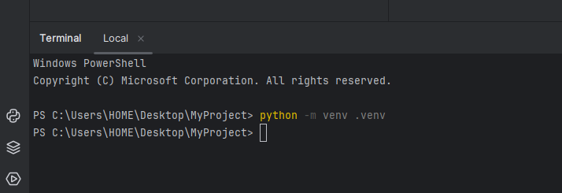

*Рисунок 1 - Создание виртуального окружения*

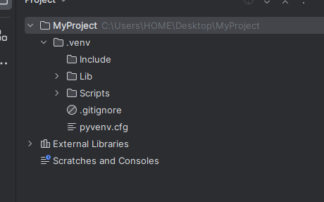

*Рисунок 2 - Структура виртуального окружения в PyCharm*

### 3.2 Активация виртуального окружения

Окружение активировано в терминале PowerShell. Префикс `(.venv)` перед приглашением командной строки подтверждает активацию (рисунок 3).

```powershell
./.venv/Scripts/Activate.ps1
```

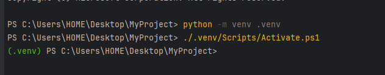

*Рисунок 3 - Активация виртуального окружения*

### 3.3 Установка Django

В активированное окружение установлен Django. На рисунке 4 показан процесс получения пакета и его зависимостей. После установки выполнена проверка версии: команда вывела `6.1.1` (рисунок 5).

```powershell
python -m pip install Django
python -m django --version
```

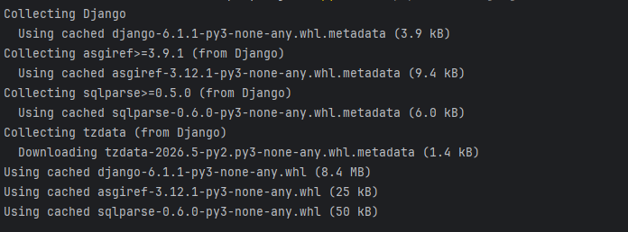

*Рисунок 4 - Установка Django и его зависимостей*

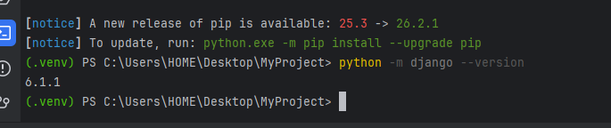

*Рисунок 5 - Проверка установленной версии Django*

### 3.4 Создание проекта

Создан проект `MySite`. Затем выполнен переход в его папку и запущен сервер разработки (рисунок 6).

```powershell
python -m django startproject MySite
cd MySite
python manage.py runserver
```

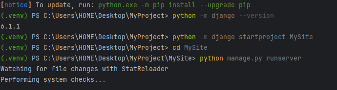

*Рисунок 6 - Создание проекта MySite и команда запуска сервера*

### 3.5 Первый запуск

Сервер запущен по адресу `http://127.0.0.1:8000/` с настройками `MySite.settings` (рисунок 7). При первом запуске Django сообщил о 18 неприменённых миграциях встроенных приложений. На этом этапе миграции ещё не применялись; сообщение не помешало запуску сервера.

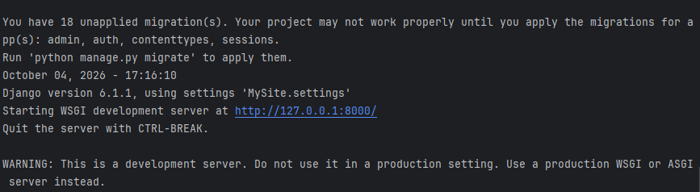

*Рисунок 7 - Запущенный сервер и сообщение о неприменённых миграциях*

В браузере открылась стартовая страница Django с сообщением об успешной установке (рисунок 8).


*Рисунок 8 - Стартовая страница Django*

### 3.6 Создание приложения news

Из папки проекта `MySite` выполнена команда создания приложения `news` и добавлена его конфигурация в `INSTALLED_APPS`. Команда завершилась без сообщения об ошибке (рисунок 9).

```powershell
python manage.py startapp news
```

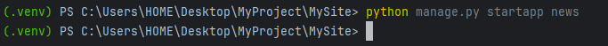

*Рисунок 9 - Создание приложения news*

### 3.7 Подключение приложения

В файле `MySite/settings.py` в список `INSTALLED_APPS` добавлена строка `'news.apps.NewsConfig'` (рисунок 10). Она указывает на класс конфигурации `NewsConfig` в файле `news/apps.py` и подключает приложение к проекту.

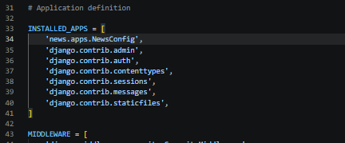

*Рисунок 10 - Приложение news в списке INSTALLED_APPS*

### 3.8 Контроллеры и маршруты

В файле `news/views.py` создано представление `index`. Оно принимает объект запроса `request` и возвращает HTTP-ответ с текстом `Hello world`.

```python
from django.http import HttpResponse


def index(request):
    return HttpResponse("Hello world")
```

В корневом файле `MySite/urls.py` импортирована функция `index` и добавлен маршрут `news/` (рисунок 11). При обращении к адресу `http://127.0.0.1:8000/news/` Django должен вызвать это представление. Список `urlpatterns` определён один раз и содержит маршруты административной панели и приложения `news`.

```python
from django.contrib import admin
from django.urls import path
from news.views import index

urlpatterns = [
    path('admin/', admin.site.urls),
    path('news/', index),
]
```

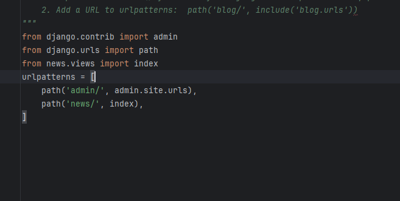

*Рисунок 11 - Подключение представления index к маршруту news/*

В браузере открыт адрес `http://127.0.0.1:8000/news/`. На странице отображается текст `Hello world` (рисунок 12), что подтверждает работу маршрута и представления `index`.

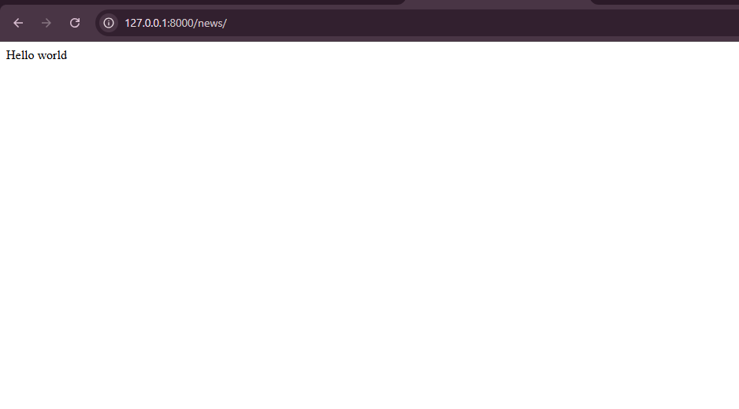

*Рисунок 12 - Ответ представления index на странице news/*

### 3.9 Изучение объекта запроса

В представление `index` перед возвратом ответа добавлена строка `print(dir(request))` (рисунок 13). Функция `dir()` возвращает список имён атрибутов и методов объекта запроса, а `print()` выводит этот список в терминал сервера при обращении к странице. Ответ браузеру по-прежнему формируется строкой `return HttpResponse("Hello world")`.

```python
def index(request):
    print(dir(request))
    return HttpResponse("Hello world")
```

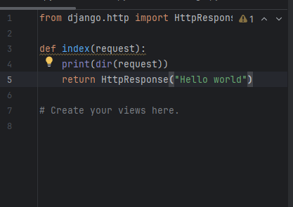

*Рисунок 13 - Вывод имён атрибутов и методов объекта request*

После обновления страницы `/news/` браузер продолжает отображать `Hello world` (рисунок 14). Это показывает, что диагностический вывод через `print()` не изменяет содержимое HTTP-ответа.

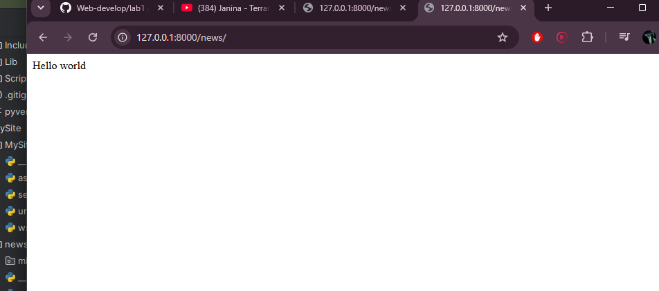

*Рисунок 14 - Страница news/ после добавления диагностического вывода*

В терминале появился список имён атрибутов и методов объекта запроса (рисунок 15), в том числе `GET`, `POST`, `COOKIES`, `method`, `path` и `session`. `GET` содержит параметры строки запроса, `POST` - данные POST-запроса, `COOKIES` - полученные от браузера cookie, `method` - HTTP-метод, а `path` - путь запроса. Команда `dir()` показывает имена, а не значения этих атрибутов.

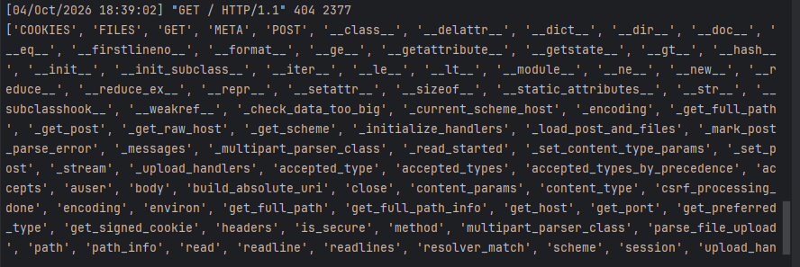

*Рисунок 15 - Результат print(dir(request)) в терминале сервера*

В верхней строке терминала также виден ответ 404 на запрос к `/`: маршрут для корневого адреса не задан. Этот запрос отличается от обращения к настроенной странице `/news/`.

### 3.10 Второе представление и тестовая страница

В файле `news/views.py` создано второе представление `test`, которое возвращает HTTP-ответ с HTML-заголовком первого уровня. Диагностическая строка `print(dir(request))` в функции `index` закомментирована после проверки.

```python
def test(request):
    return HttpResponse("<h1>Тестовая страница</h1>")
```

В корневом файле `MySite/urls.py` импортированы обе функции и добавлен отдельный маршрут `test/`:

```python
from django.contrib import admin
from django.urls import path
from news.views import index, test

urlpatterns = [
    path('admin/', admin.site.urls),
    path('news/', index),
    path('test/', test),
]
```

В браузере открыт адрес `http://127.0.0.1:8000/test/`. На странице отображается заголовок «Тестовая страница» (рисунок 16), что подтверждает работу второго представления и его маршрута.

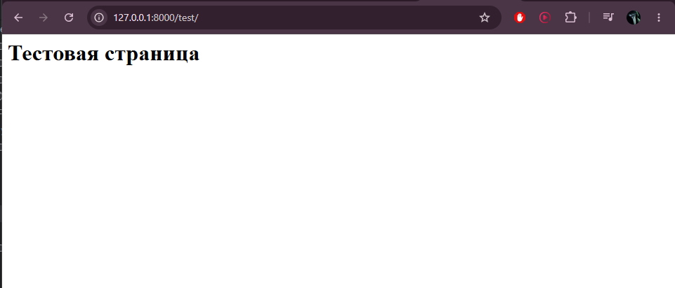

*Рисунок 16 - Тестовая страница по адресу test/*

### 3.11 Маршруты приложения и include()

В папке приложения `news` создан файл `urls.py`. В него перенесены маршруты представлений `index` и `test`:

```python
from django.urls import path
from .views import index, test

urlpatterns = [
    path('', index),
    path('test/', test),
]
```

Точка в импорте `.views` указывает на модуль текущего пакета `news`. Пустая строка в первом маршруте соответствует адресу приложения без дополнительной части пути.

В корневом `MySite/urls.py` импортирована функция `include`. Маршруты `news/` и `test/`, ранее заданные отдельно, заменены подключением `news.urls`. Основные строки настройки:

```python
from django.urls import path, include

urlpatterns = [
    path('admin/', admin.site.urls),
    path('news/', include('news.urls')),
]
```

После совпадения с префиксом `news/` Django передаёт оставшуюся часть пути маршрутам приложения. Для `/news/` остаток пустой и вызывается `index`, а для `/news/test/` остаток `test/` вызывает `test`.

Обе страницы проверены в браузере: `/news/` выводит `Hello world` (рисунок 17), а `/news/test/` отображает заголовок «Тестовая страница» (рисунок 18).

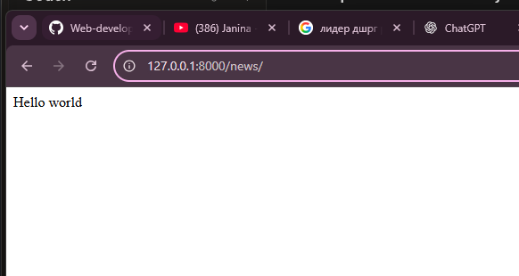

*Рисунок 17 - Страница news/ после подключения news.urls*

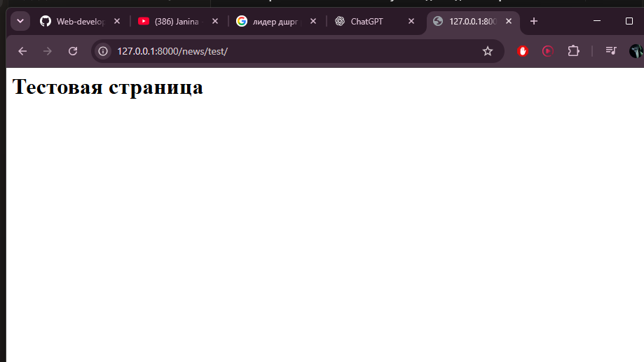

*Рисунок 18 - Вложенная тестовая страница news/test/*

## 4 Вывод

Создано и активировано виртуальное окружение, установлен Django 6.1.1, создан проект `MySite`, проверен первый запуск сервера в браузере. Создано приложение `news` и добавлена его конфигурация в `INSTALLED_APPS`. Написано представление `index` и подключён маршрут `news/`. В браузере проверен ответ представления: по адресу `/news/` отображается `Hello world`. В терминале проверен вывод имён атрибутов и методов объекта запроса через `print(dir(request))`; содержимое страницы при этом не изменилось. Создано и проверено второе представление `test`: по адресу `/test/` отображается HTML-заголовок «Тестовая страница». Маршруты приложения перенесены в `news/urls.py` и подключены через `include()`. Проверены итоговые адреса `/news/` и `/news/test/`. Цель работы достигнута: настроено окружение, разработаны представления и организована маршрутизация приложения.
