# Лабораторная работа № 2

**Тема:** Модели. CRUD<br>
**Студент:** Зорькин Арсений Станиславович<br>
**Группа:** ПИЖ-б-о-25-2(1)<br>
**Дата подготовки задания:** 04.10.2026<br>
**Вариант:** 2 - Каталог товаров<br>
**Состояние:** проверены фильтрация и get(); exclude(), изменение и удаление ещё предстоят

## Цель

Создать модель Django, подготовить и применить миграции, освоить создание, чтение, изменение и удаление записей через ORM.

## Краткая теория

Модель описывает структуру данных и ограничения полей. Миграция фиксирует изменение схемы, а применение миграции создаёт или изменяет таблицу в базе данных. ORM позволяет работать с записями через объекты Python. Операции CRUD соответствуют созданию, чтению, обновлению и удалению данных. `filter()` возвращает набор подходящих записей, `get()` ожидает одну запись, `exclude()` исключает записи по условию.

## Порядок выполнения

1. Создать приложение `catalog` в проекте `MySite`, подготовленном в ЛР1, и зарегистрировать его в `INSTALLED_APPS`.
2. Определить модель `Product` с полями варианта 2.
3. Создать и применить первоначальную миграцию.
4. Добавить поле `quantity` со значением по умолчанию `1`, создать и применить миграцию изменения модели.
5. Открыть Django shell и добавить несколько товаров с разными ценами.
6. Показать все товары и выборку товаров дешевле 1000 рублей.
7. Продемонстрировать изменение и удаление записи.
8. Проверить `filter()`, `get()` и `exclude()` на собственных данных.

## Индивидуальное задание

Выбран вариант 2 - «Каталог товаров».

Необходимо создать модель `Product` с полями `name`, `price`, `description`, `in_stock` (логическое поле) и `created_at`; добавить целочисленное поле `quantity` со значением по умолчанию `1`; вывести список товаров с ценой строго меньше 1000 рублей. Общая часть включает миграции, наполнение базы через Django shell и проверку операций CRUD.

### Поля модели и план доработки

| Поле | Тип Django | Назначение |
| --- | --- | --- |
| `name` | `CharField` | Название товара |
| `price` | `DecimalField` | Цена в рублях с двумя знаками после запятой |
| `description` | `TextField` | Описание товара |
| `in_stock` | `BooleanField` | Признак наличия товара |
| `created_at` | `DateTimeField` | Дата и время создания записи |
| `quantity` | `IntegerField(default=1)` | Количество единиц товара |

Все шесть полей описаны в модели и добавлены в таблицу двумя миграциями. Первоначальная миграция создала пять основных полей и автоматический `id`, вторая добавила `quantity`. Работа с данными ещё предстоит.

## Практическая часть и результаты

### 1 Создание приложения catalog

В активированном окружении `.venv` из папки проекта `C:\Users\HOME\Desktop\MyProject\MySite` выполнена команда создания приложения `catalog` (рисунок 1):

```powershell
python manage.py startapp catalog
```

Команда завершилась без сообщения об ошибке. В дереве проекта появилась папка `catalog` рядом с пакетом конфигурации `MySite` (рисунок 2).

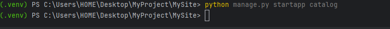

*Рисунок 1 - Создание приложения catalog*

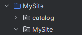

*Рисунок 2 - Папка catalog в структуре проекта*

### 2 Регистрация приложения

В файле `MySite/settings.py` в существующий список `INSTALLED_APPS` добавлена конфигурация приложения `catalog`. В списке также присутствует конфигурация `news`, созданного в ЛР1 (рисунок 3).

```python
INSTALLED_APPS = [
    'news.apps.NewsConfig',
    'catalog.apps.CatalogConfig',
    'django.contrib.admin',
    'django.contrib.auth',
    'django.contrib.contenttypes',
    'django.contrib.sessions',
    'django.contrib.messages',
    'django.contrib.staticfiles',
]
```

Строка `catalog.apps.CatalogConfig` указывает на класс конфигурации в файле `catalog/apps.py`. Регистрация приложения позволяет Django обнаружить его модели и миграции.

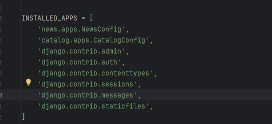

*Рисунок 3 - Регистрация catalog в списке INSTALLED_APPS*

### 3 Создание модели Product

В файле `catalog/models.py` описана модель `Product`, наследующаяся от `models.Model` (рисунок 4). Модель задаёт структуру будущей таблицы товаров.

```python
from django.db import models


class Product(models.Model):
    name = models.CharField(max_length=150)
    price = models.DecimalField(max_digits=10, decimal_places=2)
    description = models.TextField(blank=True)
    in_stock = models.BooleanField(default=True)
    created_at = models.DateTimeField(auto_now_add=True)

    def __str__(self):
        return self.name
```

Поле `name` хранит название длиной до 150 символов. Для цены используется `DecimalField` с десятью цифрами всего и двумя после запятой. Описание хранится в `TextField`; `blank=True` разрешает пустое описание при проверке формы. `in_stock` задаёт наличие товара и по умолчанию равно `True`. Дата `created_at` устанавливается автоматически при создании записи благодаря `auto_now_add=True`.

Метод `__str__` возвращает название товара, чтобы объект был понятен при выводе в консоли. Первичный ключ `id` Django добавляет автоматически.

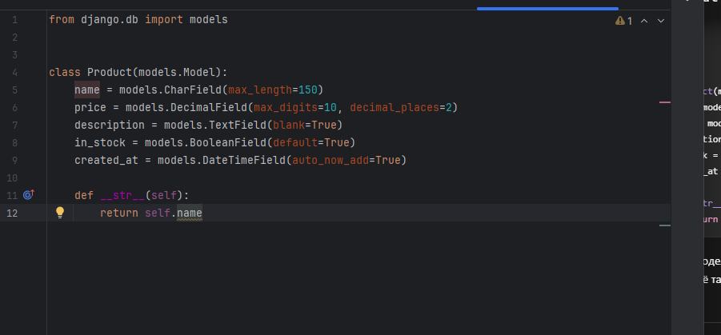

*Рисунок 4 - Модель Product в файле catalog/models.py*

При проверке сохранённого проекта командой `python manage.py check` получено сообщение `System check identified no issues (0 silenced).` Проверка выполнена в виртуальном окружении проекта; она не создаёт таблицу в базе данных.

### 4 Создание первоначальной миграции

Из папки проекта выполнена команда создания миграции приложения `catalog`:

```powershell
python manage.py makemigrations catalog
```

Django создал файл `catalog/migrations/0001_initial.py` и сообщил об операции `Create model Product` (рисунок 5).

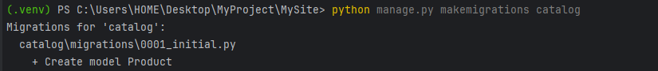

*Рисунок 5 - Создание первоначальной миграции Product*

В созданном файле определена операция `migrations.CreateModel` с пятью полями модели и автоматически добавленным первичным ключом `id` типа `BigAutoField`. Миграция фиксирует структуру модели; команда `makemigrations` не применяет её к базе данных.

### 5 Просмотр SQL миграции

Для просмотра SQL первоначальной миграции выполнена команда:

```powershell
python manage.py sqlmigrate catalog 0001
```

В терминале показан SQL с командой `CREATE TABLE "catalog_product"` (рисунок 6). Имя таблицы объединяет имя приложения `catalog` и имя модели `Product` в нижнем регистре. Первичный ключ `id` описан как `integer NOT NULL PRIMARY KEY AUTOINCREMENT`. Также присутствуют столбцы `name`, `price`, `description`, `in_stock` и `created_at`.

Вывод обрамлён командами `BEGIN` и `COMMIT`, обозначающими границы транзакции. Команда `sqlmigrate` показывает подготовленный SQL и не применяет миграцию.

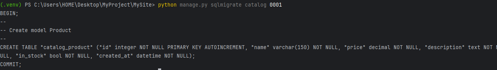

*Рисунок 6 - SQL первоначальной миграции catalog*

### 6 Применение миграций

Для применения подготовленных миграций выполнена команда:

```powershell
python manage.py migrate
```

В списке приложений для применения миграций указаны `admin`, `auth`, `catalog`, `contenttypes` и `sessions`. На рисунке 7 показано начало вывода команды: миграции встроенных приложений завершаются сообщением `OK`.

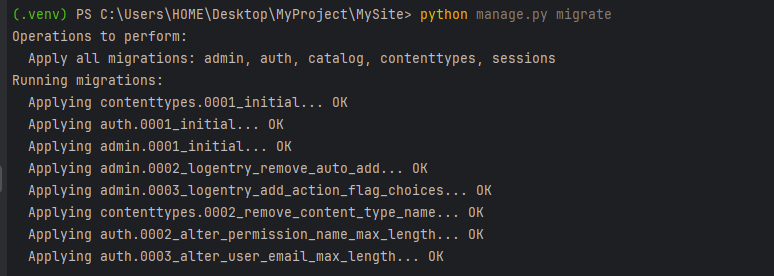

*Рисунок 7 - Начало применения миграций Django*

Дополнительная проверка файла `db.sqlite3` в режиме чтения подтвердила наличие записи `catalog / 0001_initial` в таблице `django_migrations` и созданной таблицы `catalog_product`. В таблице присутствуют столбцы `id`, `name`, `price`, `description`, `in_stock` и `created_at`. Таким образом, первоначальная миграция модели `Product` применена к базе данных.

### 7 Добавление поля quantity

Согласно варианту 2 в класс `Product` после поля `created_at` добавлено целочисленное поле количества (рисунок 8):

```python
    quantity = models.IntegerField(default=1)
```

`IntegerField` хранит целое число, а `default=1` задаёт значение по умолчанию, если количество не указано при создании объекта. Например, значение `quantity=5` означает пять единиц данного товара. Это поле хранит количество; автоматическое уменьшение количества при покупке потребовало бы отдельной логики приложения.

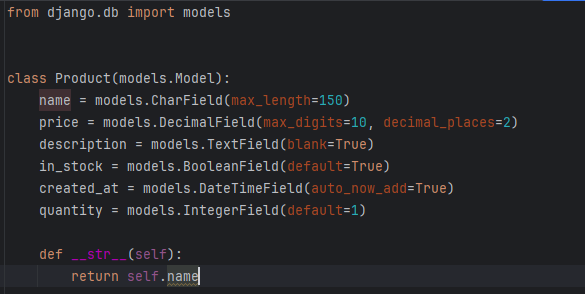

*Рисунок 8 - Модель Product с полем quantity*

### 8 Миграция добавления quantity

После изменения модели повторно выполнена команда:

```powershell
python manage.py makemigrations catalog
```

Django создал файл `catalog/migrations/0002_product_quantity.py` и сообщил `Add field quantity to product` (рисунок 9).

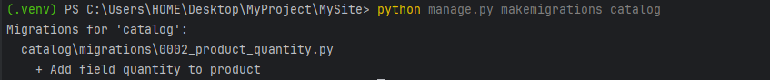

*Рисунок 9 - Создание миграции добавления quantity*

Миграция зависит от `catalog.0001_initial` и содержит одну операцию добавления поля:

```python
migrations.AddField(
    model_name='product',
    name='quantity',
    field=models.IntegerField(default=1),
)
```

### 9 Применение миграции quantity

Для применения изменения модели повторно выполнена команда:

```powershell
python manage.py migrate
```

В терминале получено сообщение `Applying catalog.0002_product_quantity... OK` (рисунок 10). Таким образом, миграция добавления поля `quantity` успешно применена к таблице товаров. Уже применённые миграции не выполнялись повторно.

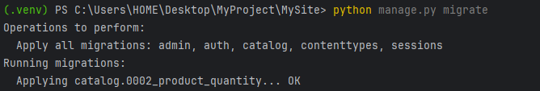

*Рисунок 10 - Успешное применение миграции quantity*

Структура таблицы соответствует модели `Product` с шестью полями варианта и автоматическим первичным ключом.

### 10 Создание первого товара через Django shell

Для работы с ORM открыта консоль Django командой `python manage.py shell`. В консоли импортирована модель `Product`, создан объект товара и вызван метод `save()`:

```python
from catalog.models import Product

product = Product(name="Мышь", price="700.00", description="Проводная мышь")
product.save()
product.pk
product.quantity
```

В результате сохранён товар «Мышь» стоимостью 700 рублей. Выражение `product.pk` вернуло `1`, что показывает автоматически присвоенный первичный ключ записи. `product.quantity` также вернуло `1`: количество не передавалось в конструктор, поэтому использовано значение `default=1` (рисунок 11).

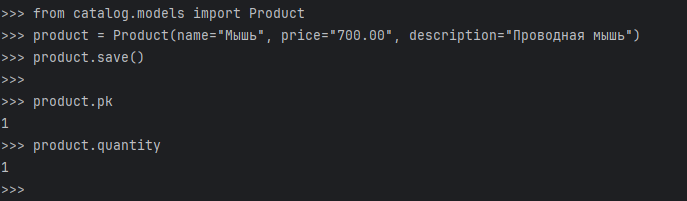

*Рисунок 11 - Создание и сохранение первого товара*

Конструктор `Product(...)` создаёт объект в памяти, а `save()` записывает его в базу данных. Отсутствие вывода после `save()` является обычным поведением метода. Выполнена операция Create.

### 11 Создание товаров через objects.create()

В той же консоли Django добавлены ещё три товара с помощью менеджера модели:

```python
Product.objects.create(name="Клавиатура", price="1500.00", quantity=3)
Product.objects.create(name="Коврик", price="300.00", quantity=10)
Product.objects.create(name="Наушники", price="1000.00", in_stock=False, quantity=0)
```

Метод `objects.create()` создаёт объект, сразу сохраняет его в базу и возвращает созданный объект. В консоли показаны названия товаров благодаря методу `__str__` (рисунок 12). Отдельный вызов `save()` после `create()` не требуется.

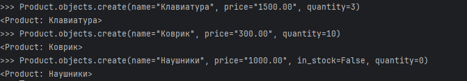

*Рисунок 12 - Создание трёх товаров через objects.create()*

Для проверки условия варианта подготовлены товары с ценами ниже 1000 рублей, выше 1000 рублей и ровно 1000 рублей:

| Товар | Цена, руб. | Количество |
| --- | --- | --- |
| Мышь | 700,00 | 1 |
| Клавиатура | 1500,00 | 3 |
| Коврик | 300,00 | 10 |
| Наушники | 1000,00 | 0 |

Для наушников также явно задано `in_stock=False`.

### 12 Чтение всех товаров

Выполнена команда чтения записей:

```python
Product.objects.all()
```

Получен `QuerySet` из четырёх объектов: «Мышь», «Клавиатура», «Коврик» и «Наушники» (рисунок 13). Метод `all()` возвращает набор записей модели. Имена объектов в выводе соответствуют результату `__str__`. Таким образом, продемонстрирована операция Read.

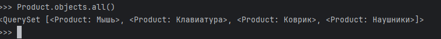

*Рисунок 13 - Чтение всех товаров методом all()*

### 13 Фильтрация товаров по условию варианта

Для выполнения индивидуального задания получен список товаров дешевле 1000 рублей:

```python
Product.objects.filter(price__lt=1000)
Product.objects.filter(price__lt=1000).values("name", "price")
```

Условие `price__lt=1000` использует сравнение «строго меньше». В первом запросе получен `QuerySet` из товаров «Мышь» и «Коврик». Метод `values()` во втором запросе показал выбранные поля в виде словарей: цена мыши равна `Decimal('700.00')`, цена коврика - `Decimal('300.00')` (рисунок 14). `Decimal` представляет десятичные значения цены.

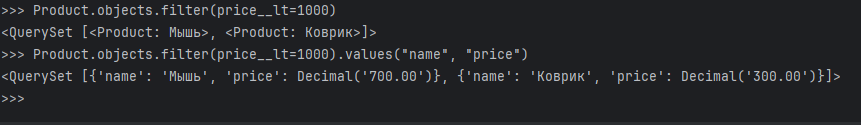

*Рисунок 14 - Выборка товаров дешевле 1000 рублей*

Клавиатура стоимостью 1500 рублей не входит в результат. Наушники стоимостью ровно 1000 рублей тоже исключены, что подтверждает строгое сравнение. Индивидуальное условие варианта 2 выполнено.

### 14 Получение одного товара методом get()

По первичному ключу получен один объект модели:

```python
product = Product.objects.get(pk=1)
product.name
product.price
product.quantity
```

В результате прочитаны название «Мышь», цена `Decimal('700.00')` и количество `1` (рисунок 15). Метод `get()` возвращает один объект модели, поля которого доступны через точку. Значение `pk` обозначает первичный ключ записи. Если запись не найдена, метод вызывает исключение `DoesNotExist`; если условию соответствует несколько записей, возникает `MultipleObjectsReturned`.

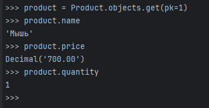

*Рисунок 15 - Получение товара по первичному ключу*

Следующие этапы: проверка `exclude()`, изменения и удаления записей.

## Иллюстрации

Снимки экрана студент сделает самостоятельно: модель в редакторе, вывод `makemigrations` и `migrate`, создание и просмотр записей в shell, фильтрация, обновление и удаление. Подписи и ссылки будут добавлены рядом с соответствующими шагами.

## Контрольные вопросы

При завершении отчёта нужно ответить на вопросы методички о моделях, типах полей, `blank` и `null`, миграциях, суперпользователе, ORM, `filter()` и `get()`, медиафайлах и методе `__str__`.

## Текущий результат

В проекте создано и зарегистрировано приложение `catalog` для варианта 2. Написана модель `Product` с полями `name`, `price`, `description`, `in_stock` и `created_at`, добавлен метод `__str__`. Проверка Django прошла без ошибок. Создана первоначальная миграция `catalog/0001_initial`, которая описывает модель `Product`. Командой `sqlmigrate` просмотрен SQL создания таблицы `catalog_product`. Первоначальная миграция применена; в базе SQLite создана таблица `catalog_product`. Поле `quantity` со значением по умолчанию `1` добавлено в модель. Создана миграция `0002_product_quantity` для нового поля. Вторая миграция успешно применена: получено сообщение `OK`. Все поля модели добавлены в базу. Через конструктор модели и `save()` создан товар «Мышь»: первичный ключ равен `1`, количество по умолчанию равно `1`. Методом `objects.create()` добавлены ещё три товара. Команда `all()` вернула четыре записи; выполнены операции Create и Read. Запрос `filter(price__lt=1000)` вернул мышь за 700 рублей и коврик за 300 рублей; условие варианта выполнено. Методом `get(pk=1)` получена мышь и прочитаны её название, цена и количество. Проверка `exclude()`, изменения и удаления ещё предстоит. Итоговый вывод будет оформлен после проверки этих этапов.
